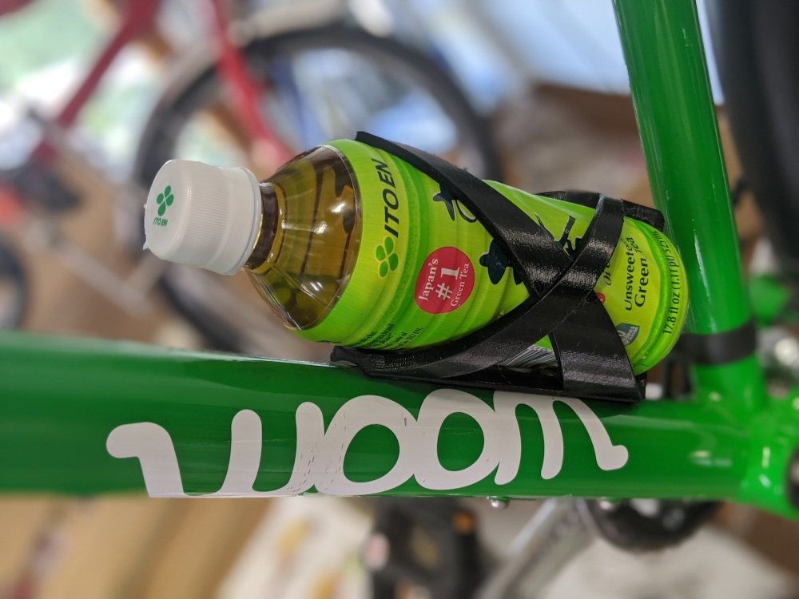
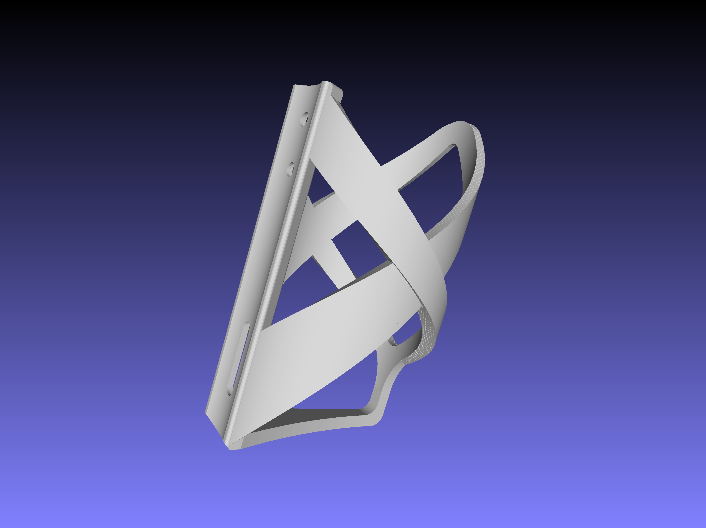

# bottlecage - OpenSCAD version of the "Prusa ASA Bottle Cage"

Prusa's design of the bicycle bottle cage is great. But unfortunately, the model file cannot easily be edited. If you
have a non-standard bicycle mount or you want to transport other types of bottles, you need to make adjustments. That's
where my [OpenSCAD](https://openscad.org) recreation of the model comes in handy. All the major parameters are fully
customizable at the top of the [source file](bottlecage.scad).

Recreations of another 3D model are rarely pixel perfect, but I have tried to stay as close as possible to the dimensions
of the Prusa design. There are a small number of notable differences though. I did not implement the sweeping curves on the
bracket that attaches to the bike. I was afraid it would weaken the mount points too much. I also thickened a few other parts.

And I didn't bother implementing the logo on the side of the bottle holder. This is doable with OpenSCAD. But it is tedious to
make it look pretty, and it simply wasn't a priority.

The original version of Prusa's bottle cage can be found at https://www.prusaprinters.org/prints/5003-asa-bottle-cage

Please note, that while I am the author of the OpenSCAD version of this model, the original design was not made by me
and instead is copyrighted by [Prusa Research](https://prusa3d.com), and was released into the public domain under a
Creative Commons CC0 license.

You can also find this model on [Prusa Printers](https://prusaprinters.org/prints/32158-asa-bottle-cage-openscad-model).
